# Project Work Group 4 - DLCV
This is the project repository for the group 4 at the DLCV. The Team is made up by:

| 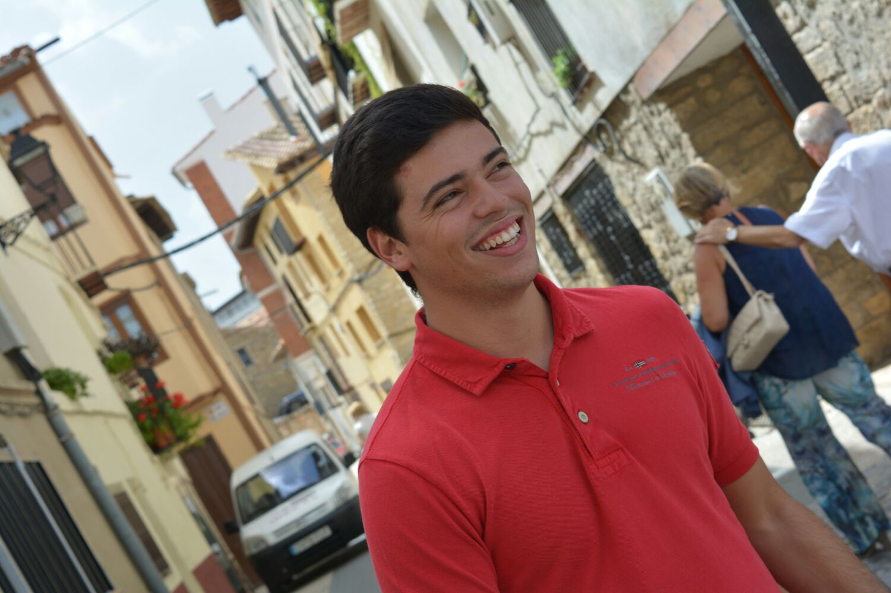 | 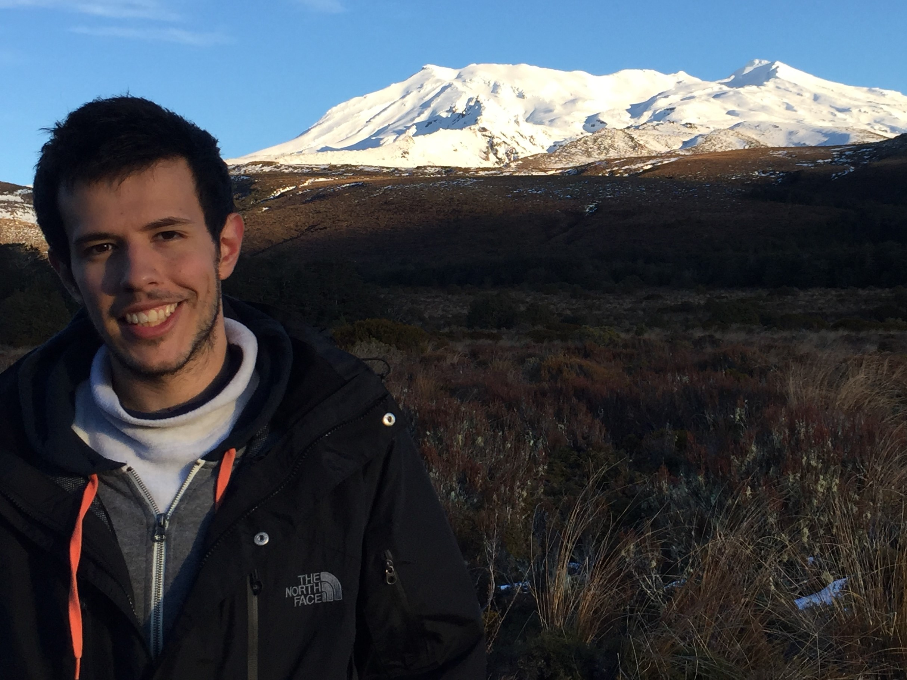 | 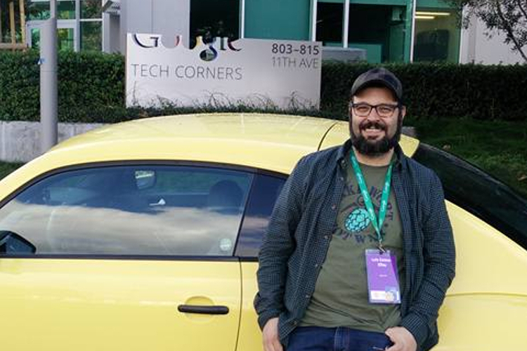 |
| :---: | :---: | :---: |
| Adrià Gil Sorribes | Genís Floriach Pigem | Luis Esteve Elfau |

It is going to be explained below what has been done during the [Deep Learning for Computer Vison](https://telecombcn-dl.github.io/2017-dlcv/) course at UPC at Summer 2017.

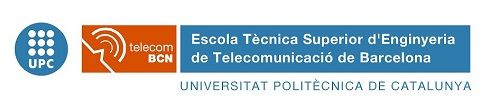

# Task 1 - CNN Cifar10

The main objective of this second task is to explore the whole recipe of the CIFAR dataset. The main idea is to design a Convolutional Neural Network (CNN) and train it with the CIFAR dataset.

- Task 1.1 Architecture of the CNN
    
    In this subtask the main goal is to design the architecture of the CNN: Neurons per layer. Amount of layers. Types of layers (Fully-connected, Convolutional) as well as nonlinearities (ReLu, Sigmoid,...)
    
    We have developed 2 architectures:
   
   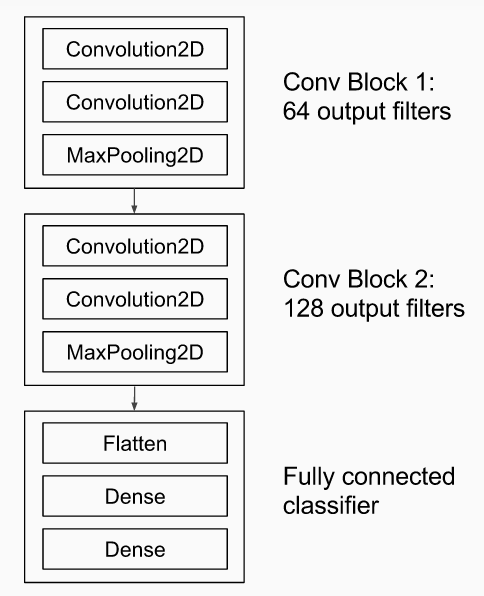 

    And
    
   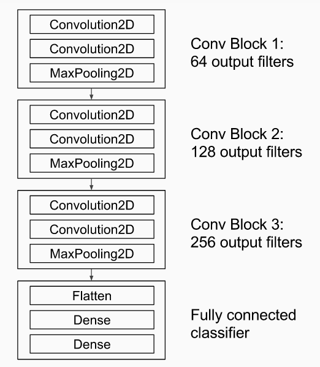
   
- Task 1.2 Training the CNN

    In this second subtask the idea is train the CNN, exploring some improvements: Data augmentation, batch size, amount of epochs, regularization (drop outs), learning rate or optimizers. 
  
    We have experimented with the number of epochs as well as regularization (adding drop outs) in oder to improve the performance of the CNN.

- Task 1.3 Visualization
    
    In this third task we have to provide some kind of visualization of the processes of the CNN: Visualize filter responses (from our network or from other pre-trained network), t-SNE or Off-the-shelf AlexNet (Visualize local classification over a small set of images)

# Task 2 - Training a softmax classifier

The main objective of this second task is to do some transfer learning. The main idea is to adapt some pre-trained neural network models to classify images on a new dataset which is composed by images of buildings of Terrassa. This task is divided in two subtasks:

- CNN trained with CIFAR10 + Softmax layer on top of CNN
    
   In this subtask the main goal is to use the previously implemented and trained CNN with the CIFAR10 dataset in order to classify the    images of the new database (TerrassaBuildings). For this reason we will load the model, we will extract the top layers and we will      train a new top_model (fully connected layers) softmax classifier with the new database.
   
   

- Off the Shelf VGG19 + Softmax layer on top of the CNN

  In this second subtask the idea is the same as in the previous but this time loading an Imagenet pre-trained model such as the VGG19.   This model has been trained with the imagenet database which is layer and far wider than the CIFAR10. With this configuration we         expect better results.
  
  

# Task 3 - Fine-tuning

In this task we fine tune the last convolutional layers of the VGG16 network. To do so, we start from the network obtained at the previous task after training the last convolutional layers. It is important to start the fine-tuning with all the layers previously trained. One should not add a randomly initialized fully-connected network on top of a pre-trained convolutional base. This is because the large gradient updates triggered by the randomly initialized weights would wreck the learned weights in the convolutional base.

We only fine-tune the last convolutional block  in order to prevent overfitting, since the entire network have a very large capacity and thus a strong tendency to overfit with such a small dataset. The features learned by low-level convolutional blocks are more general, less abstract than those found higher-up, so it is sensible to keep the first few blocks fixed (more general features) and only fine-tune the last one (more specialized features).

The traininig is done with SGD and a very slow learning rate. We do it in that way to make sure the magnitude of the updates stays very small, so as not to wreck the previously learned features.

# Task 4 - Improve if possible

To improve the performance of our classifier we considered the idea of using an external dataset of buildings to fine tune more layers of the network. By doing that, we aim to train a network more specialized in buildings so that when we perform the transfer learning for the Terrassa Building we get better results. 

Making a quick search we have found the following datasets:

- Places dataset (10M images) 
- Oxford Buildings dataset (5K images)  
- Paris Buildings dataset (6K images)

We discarded the first option because we could not find any pretrained network with this dataset written in keras. Besides, it is not a dataset of buildings and many of the classes would not have been helpful for the task. That's why we decided to go with the Oxford Building Dataset. However, after taking a look at the images we found out that many of them were not buildings. 

Re-reading the website of the dataset we found this piece of information:

"For each image and landmark in our dataset, one of four possible labels was generated:
- Good: A nice, clear picture of the object/building.
- OK: More than 25% of the object is clearly visible.
- Bad The object is not present.
- Junk: Less than 25% of the object is visible, or there are very high levels of occlusion or distortion."

Then, after removing the band and junk images:

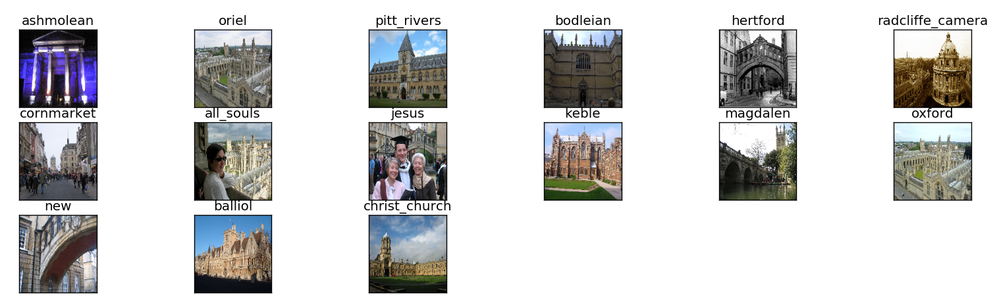

However, now the amount of images is left is very small (600) which is even less than the Terrassa Building database. Therefore it is not useful for our case.

Another solution that we proposed to improve the performance was the use of data augmentation techniques. After analyzing several images from the dataset we have seen that there are rotated images (90 degrees). Hence, to obtain invariance to this fact we added random rotations.

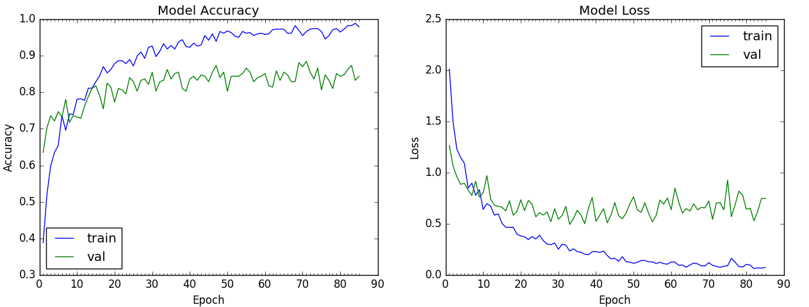

As we can see we get a small improvement with respect to case in Task 2.2

# Task 5 - Cycle Generative Adversari Network (GAN)

The last task of the project is to make our own deep neurla network project. We have choosen to implement the **cross domain image transfer** - we want to take an image from an input domain and then transform it into an image of target domain without necessarily having a one-to-one mapping between images from input to target domain in the training set. Relaxation of having one-to-one mapping makes this formulation quite powerful - the same method could be used to tackle a variety of problems by varying the input-output domain pairs - performing artistic style transfer, adding bokeh effect to phone camera photos, creating outline maps from satellite images or convert horses to zebras and vice versa!! This is achieved by a type of generative model, specifically a Generative Adversarial Network dubbed CycleGAN. The definition of a Cyclic GAN is the following:

- Adversarial training can, in theory, learn mappings  G  and  F  that produce outputs identically distributed as target domains  Y  and  X  respectively. However, with large enough capacity, a network can map the same set of input images to any random permutation of images in the target domain, where any of the learned mappings can induce an output distribution that matches the target distribution. Thus, an adversarial loss alone cannot guarantee that the learned function can map an individual input  xi  to a desired output  yi.

As indicated in the figures, the model works by taking an input image from domain  **Da**  which is fed to our first generator  **GeneratorA→B**  whose job is to transform a given image from domain  **Da**  to an image in target domain  **Db** . This new generated image is then fed to another generator  **GeneratorB→A**  which converts it back into an image,  **CyclicA** , from our original domain  **Da**  (think of autoencoders, except that our latent space is  **Dt** ). And this output image must be close to original input image to define a meaningful mapping that is absent in unpaired dataset.
Two inputs are fed into each discriminator (one is original image corresponding to that domain and other is the generated image via a generator) and the job of discriminator is to distinguish between them, so that discriminator is able to defy the adversary (in this case generator) and reject images generated by it. While the generator would like to make sure that these images get accepted by the discriminator, so it will try to generate images which are very close to original images in Class  **Db**.

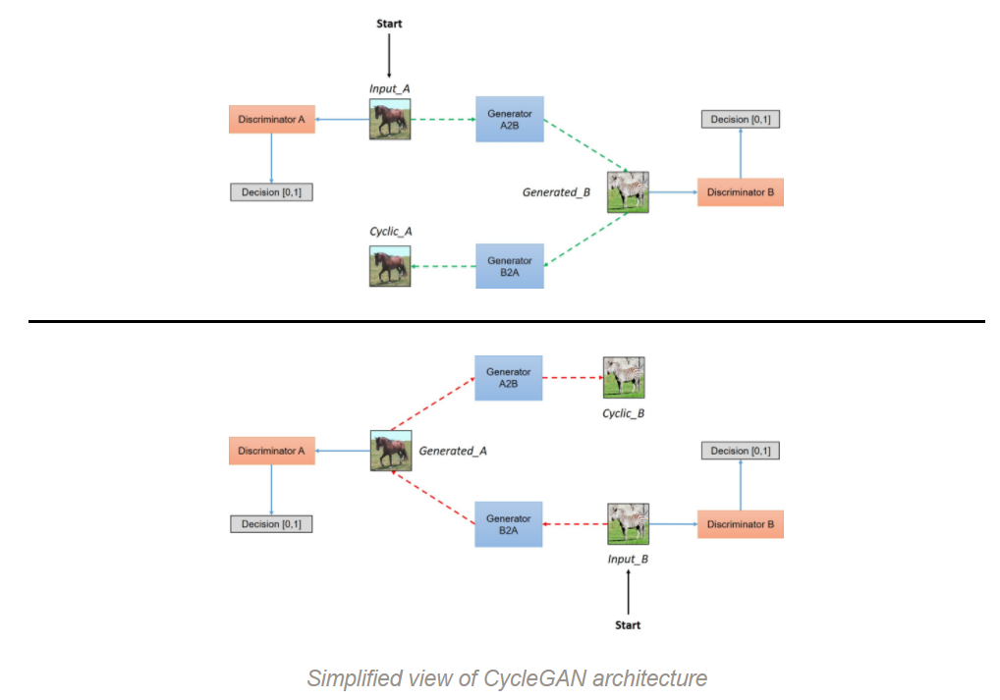

In our casse we are going to train a Cyclic GAN with two different datasets:

- Places & Vangoogh

| |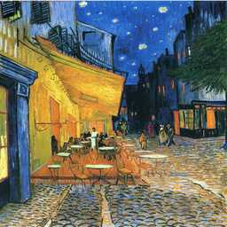
| :---: | :---: |
| Places | VanGoogh |

-Results after 100 epochs: 

|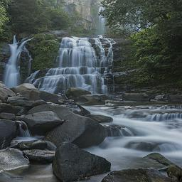|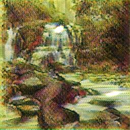|

- Summer Yosemite & Winter Yosemite

| 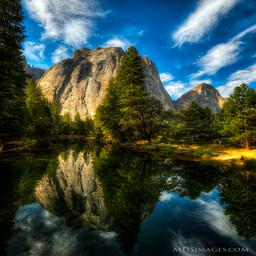|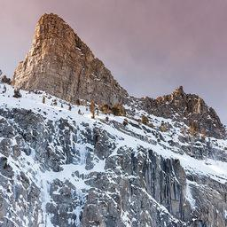
| :---: | :---: |
|Summer Yosemite | Winter Yosemite |

-Results after 100 epochs: 

|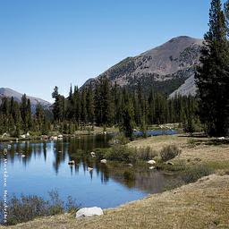|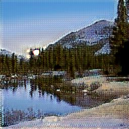|
